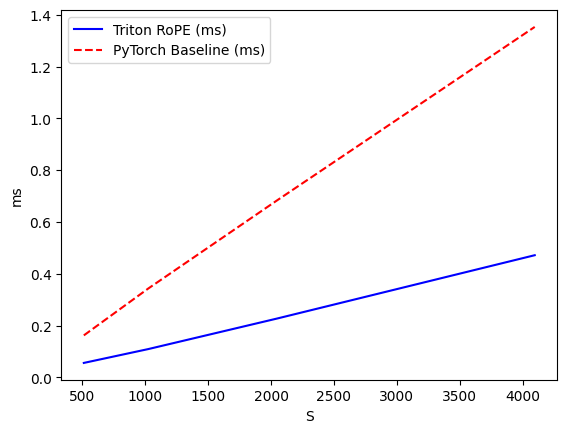
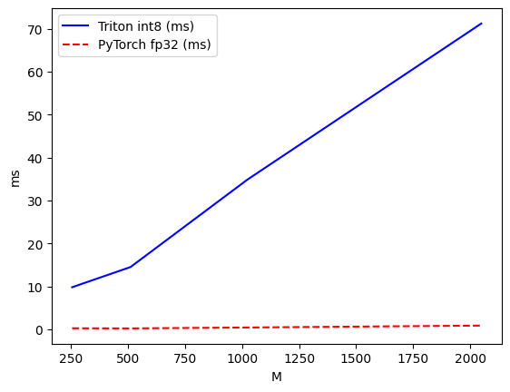

# triton-kernels

Custom Triton kernels for LLM inference primitives, benchmarked on T4 (sm_75, Kaggle).

## Kernels

### RoPE (Rotary Position Embedding)
Fused kernel that computes real/imaginary rotation in a single pass,
avoiding the two-tensor cat overhead of the PyTorch baseline.

| S    | Triton (ms) | PyTorch (ms) | Speedup |
|------|-------------|--------------|---------|
| 512  | 0.056       | 0.162        | 2.9x    |
| 1024 | 0.109       | 0.343        | 3.1x    |
| 2048 | 0.227       | 0.683        | 3.0x    |
| 4096 | 0.472       | 1.353        | 2.9x    |

### Fused Attention
Online softmax attention with causal masking. Never materializes the full
NxN score matrix — processes in tiles to bound memory usage.
Compared against `torch.nn.functional.scaled_dot_product_attention`.

| N_CTX | Triton (ms) | PyTorch SDPA (ms) | Notes |
|-------|-------------|-------------------|-------|
| 512   | 3.30        | 0.18              | SDPA uses cuDNN fused path on T4 |
| 1024  | 10.12       | 0.34              | |
| 2048  | 38.00       | 1.34              | |
| 4096  | 150.19      | 5.55              | |

SDPA on T4 uses a heavily optimized cuDNN kernel. The Triton implementation
demonstrates the tiling and online softmax algorithm — the same approach
used by FlashAttention — without the low-level CUDA tuning that makes
production implementations competitive. On sm_80+ with proper block size
tuning and shared memory optimization this gap closes significantly.

### int8 Matmul
Blocked integer matmul kernel. On T4 (sm_75), int8 tensor cores are not
available so operands are upcast to fp16 before the dot product. Demonstrates
the blocking pattern and accumulation logic used in quantized weight serving.

| M    | Triton int8 (ms) | PyTorch fp32 (ms) | Notes |
|------|------------------|-------------------|-------|
| 256  | 9.81             | 0.25              | fp16 upcast required on sm_75 |
| 1024 | 34.89            | 0.44              | |
| 2048 | 71.24            | 0.88              | |

Native int8 tensor core matmul (what quantized inference engines use in
production) requires sm_80+. On A100/H100 this kernel would use `tl.dot`
on int8 directly, with int32 accumulation, and would beat fp32 cuBLAS.

## Hardware
All benchmarks: NVIDIA T4, sm_75, CUDA 12.x, Triton 3.x

## What these kernels relate to
Cloudflare's Infire inference engine ships speculative decoding, prefix
caching, and fp8/int8 quantization on their inference backend. These kernels
target the same primitive operations: position encoding (RoPE), attention
with bounded memory (fused attention tiling), and quantized matmul (int8).
The T4 hardware constraints mirror edge inference constraints — limited
memory, no latest-gen tensor cores — which is exactly the deployment
environment Infire is optimized for.